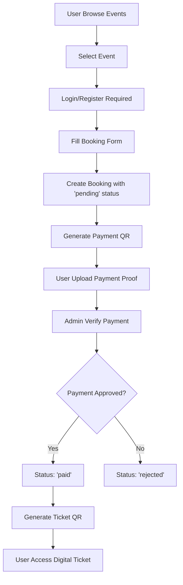

# 🏗️ Arsitektur System Event Management

## 📐 Struktur Proyek

```
event-management/
├── app/
│   ├── Filament/
│   │   └── Resources/          # Admin panel resources
│   ├── Http/
│   │   └── Controllers/        # Web controllers
│   ├── Models/                 # Eloquent models
│   ├── Services/               # Business logic services
│   └── Providers/              # Service providers
├── database/
│   ├── migrations/             # Database schema
│   ├── seeders/               # Sample data
│   └── factories/             # Model factories
├── resources/
│   ├── views/                 # Blade templates
│   ├── css/                   # Stylesheets
│   └── js/                    # JavaScript files
├── routes/
│   ├── web.php                # Web routes
│   └── auth.php               # Authentication routes
├── storage/
│   ├── app/public/            # Uploaded files
│   └── logs/                  # Application logs
└── public/
    ├── storage/               # Symlinked storage
    └── build/                 # Compiled assets
```

## 🧩 Komponen Utama

### 1. Models & Relationships

#### Event Model
```php
class Event extends Model {
    // Relationships
    public function category() // EventCategory
    public function organizer() // Organizer
    public function bookings() // Booking[]
    
    // Methods
    public function hasAvailableQuota($quantity)
    public function getAvailableSeatsAttribute()
    public function scopePublished($query)
}
```

#### Booking Model
```php
class Booking extends Model {
    // Relationships
    public function user() // User
    public function event() // Event
    public function tickets() // Ticket[]
    
    // Methods
    public function canBeValidated()
    public function isExpired()
    public function calculateTotal()
}
```

#### User Model
```php
class User extends Model {
    // Relationships
    public function bookings() // Booking[]
    
    // Methods (from Laravel Breeze)
    public function sendEmailVerificationNotification()
}
```

### 2. Services Layer

#### BookingService
```php
class BookingService {
    public function createBooking(Event $event, array $data)
    public function confirmBooking(Booking $booking, array $paymentData)
    public function generateTicketQR(Booking $booking)
    public function validateTicket(string $bookingCode)
    public function expireBooking(Booking $booking)
}
```

#### QRCodeService
```php
class QRCodeService {
    public function generatePaymentQR(string $accountNumber, float $amount)
    public function generateTicketQR(string $bookingCode, int $eventId)
    public function validateTicketQR(string $qrData)
    public function generateBookingPaymentQR(Booking $booking)
}
```

### 3. Controllers

#### EventController (Public)
- `index()` - List published events
- `show($id)` - Show event details

#### BookingController (Authenticated)
- `store()` - Create new booking
- `show()` - Show booking details
- `payment()` - Show payment page
- `uploadProof()` - Upload payment proof
- `confirm()` - Admin confirmation

#### TicketController (Authenticated)
- `show()` - Show digital ticket
- `download()` - Download PDF ticket
- `generateQR()` - Generate QR if missing
- `validateTicket()` - Entry validation

#### DashboardController (Authenticated)
- `index()` - User dashboard with statistics

### 4. Admin Panel (Filament)

#### EventsResource
- Form dengan sections (Basic Info, Details, Payment)
- Table dengan filtering dan searching
- Bulk actions untuk publish/unpublish

#### BookingsResource
- Form untuk edit booking details
- Table dengan status badges
- Filters berdasarkan status dan tanggal

#### UsersResource
- User management dengan roles
- Profile editing capabilities

## 🔄 Flow Diagram

### Booking Flow


### Payment Verification Flow
```mermaid
graph TD
    A[User Upload Payment Proof] --> B[Booking Status: 'pending']
    B --> C[Admin Review Payment]
    C --> D{Verification Decision}
    D -->|Approve| E[BookingService.confirmBooking()]
    D -->|Reject| F[Update Status to 'rejected']
    E --> G[Status: 'paid']
    G --> H[Generate Ticket QR]
    H --> I[Send Confirmation Email]
    F --> J[Send Rejection Email]
```

### Entry Validation Flow
```mermaid
graph TD
    A[Staff Scan QR Code] --> B[QRCodeService.validateTicketQR()]
    B --> C{Valid QR?}
    C -->|No| D[Show Error Message]
    C -->|Yes| E[Find Booking by Code]
    E --> F{Booking Valid?}
    F -->|No| G[Show Booking Error]
    F -->|Yes| H[BookingService.validateTicket()]
    H --> I[Update entry_validated_at]
    I --> J[Show Success Message]
```

## 💾 Database Design

### ERD (Entity Relationship Diagram)
```
Users ||--o{ Bookings : creates
Events ||--o{ Bookings : has
EventCategories ||--o{ Events : categorizes
Organizers ||--o{ Events : organizes
Bookings ||--o{ Tickets : generates
Bookings }o--|| DiscountCodes : uses
```

### Key Indexes
```sql
-- Performance critical indexes
CREATE INDEX idx_events_status_date ON events(status, start_date);
CREATE INDEX idx_bookings_event_status ON bookings(event_id, status);
CREATE INDEX idx_bookings_user_date ON bookings(user_id, booking_date);
CREATE INDEX idx_bookings_code ON bookings(booking_code);
```

### Data Integrity Constraints
```sql
-- Foreign key constraints
ALTER TABLE bookings ADD CONSTRAINT fk_bookings_user 
    FOREIGN KEY (user_id) REFERENCES users(id) ON DELETE CASCADE;
    
ALTER TABLE bookings ADD CONSTRAINT fk_bookings_event 
    FOREIGN KEY (event_id) REFERENCES events(id) ON DELETE CASCADE;
    
-- Check constraints
ALTER TABLE bookings ADD CONSTRAINT chk_quantity_positive 
    CHECK (quantity > 0);
    
ALTER TABLE events ADD CONSTRAINT chk_quota_positive 
    CHECK (quota >= 0);
```

## 🔐 Security Architecture

### Authentication Layer
- **Laravel Breeze**: Login, register, password reset
- **Session-based**: Web guard dengan cookies
- **CSRF Protection**: Semua form dilindungi token
- **Rate Limiting**: Login attempts dan API calls

### Authorization Layer
```php
// Gates (policies)
Gate::define('view-booking', function ($user, $booking) {
    return $user->id === $booking->user_id;
});

Gate::define('manage-events', function ($user) {
    return $user->is_admin;
});
```

### Input Validation
```php
// Form requests dengan validation rules
class BookingRequest extends FormRequest {
    public function rules() {
        return [
            'quantity' => 'required|integer|min:1|max:10',
            'booker_name' => 'required|string|max:255',
            'booker_email' => 'required|email|max:255',
        ];
    }
}
```

### File Upload Security
```php
// Validated file uploads
$request->validate([
    'payment_proof' => [
        'required',
        'image',
        'mimes:jpeg,png,jpg',
        'max:2048', // 2MB
        'dimensions:min_width=100,min_height=100'
    ]
]);
```

## 📊 Performance Considerations

### Database Optimization
- **Query Optimization**: Eager loading relationships
- **Indexing Strategy**: Critical indexes untuk fast lookups
- **Connection Pooling**: Database connection management
- **Query Caching**: Cache expensive aggregation queries

### Caching Strategy
```php
// Multi-level caching
// 1. Application Cache (Redis/File)
Cache::remember('popular_events', 3600, function () {
    return Event::withCount('bookings')->orderBy('bookings_count', 'desc')->take(10)->get();
});

// 2. Query Result Cache
Event::where('status', 'published')->remember(1800)->get();

// 3. View Fragment Caching
@cache('event_list', $events)
    @include('events.list', compact('events'))
@endcache
```

### Asset Optimization
- **Vite Build**: Modern bundling dengan tree-shaking
- **CSS Purging**: Remove unused Tailwind classes
- **Image Optimization**: WebP format dengan fallbacks
- **CDN Integration**: Static assets served dari CDN

## 🔄 State Management

### Booking Status Flow
```php
// Status transitions
const STATUS_TRANSITIONS = [
    'pending' => ['paid', 'expired', 'cancelled'],
    'paid' => ['confirmed', 'cancelled'],
    'confirmed' => ['completed', 'cancelled'],
    'expired' => [], // Terminal state
    'cancelled' => [], // Terminal state
    'completed' => [], // Terminal state
];
```

### Event Status Flow
```php
const EVENT_STATUS_TRANSITIONS = [
    'draft' => ['published', 'cancelled'],
    'published' => ['completed', 'cancelled'],
    'cancelled' => [], // Terminal state
    'completed' => [], // Terminal state
];
```

## 🧪 Testing Strategy

### Unit Tests
- **Model Tests**: Relationships dan methods
- **Service Tests**: Business logic validation
- **Helper Tests**: Utility functions

### Feature Tests
- **Controller Tests**: HTTP responses dan redirects
- **Integration Tests**: End-to-end workflows
- **Browser Tests**: Frontend functionality dengan Dusk

### Test Data Management
```php
// Factory definitions
class EventFactory extends Factory {
    public function definition() {
        return [
            'name' => $this->faker->sentence(3),
            'start_date' => $this->faker->dateTimeBetween('now', '+3 months'),
            'price' => $this->faker->numberBetween(50000, 500000),
            'quota' => $this->faker->numberBetween(50, 1000),
        ];
    }
}
```

## 📱 Mobile Responsiveness

### Responsive Design Strategy
- **Mobile-First**: Design dimulai dari mobile breakpoint
- **Tailwind Breakpoints**: sm, md, lg, xl, 2xl
- **Touch-Friendly**: Button sizes minimum 44px
- **Performance**: Lazy loading dan image optimization

### PWA Features (Future Enhancement)
- **Service Worker**: Offline functionality
- **App Manifest**: Install to home screen
- **Push Notifications**: Event reminders
- **Background Sync**: Offline form submissions

---

*Dokumentasi ini akan diupdate seiring dengan perkembangan sistem.*
